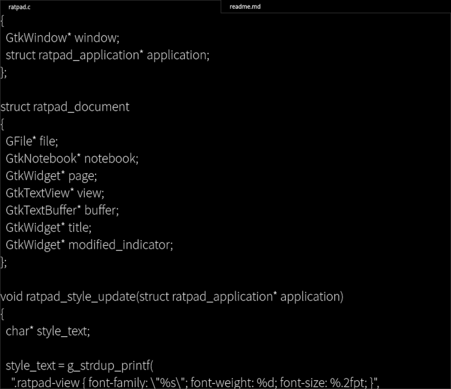

# ratpad
a super minimal gtk text editor inspired by mousepad.

gtk and minimal are two words that do not go easily together. however, gtks text editing widgets provide many behaviors familiar from other gtk applications by default, which makes working with them more seamless than alternative implementations or terminal editors. this includes clipboard paste without terminal interpretation problems, text zooming, and seamless input-method support.

ratpad is deliberately restricted to a specific use case: quick plain-text editing. some properties can be configured at compile time, but the default configuration supports only utf-8 and lf line endings. it is not intended for handling legacy text formats or providing code-writing assistance.

the editor also does not ask for confirmation before closing a document with unsaved changes. it follows the users demand directly. this deliberately removes friction from workflows where documents are frequently opened, changed, discarded, or replaced.

# features
* compile-time configuration.
* plain-text editing.
* multiple documents in tabs.
* utf-8 file handling.
* lf line endings.
* tab key inserts 2 spaces.
* mouse-wheel zoom with `ctrl+wheel`.
* `ctrl+n`: new document.
* `ctrl+o`: open file.
* `ctrl+s`: save file.
* `ctrl+r`: reload file, with confirmation when unsaved changes exist.
* `ctrl+w`: close current tab; close the window if it is the last tab.
* `ctrl+q`: quit the application.
* `ctrl+pageup`: previous tab.
* `ctrl+pagedown`: next tab.
* `ctrl+f`: show the find bar.
* standard gtk undo/redo.
* case-insensitive forward string search.
* repeated search cycles through matches.
* automatic wrap-around search.
* find bar remains open while cycling matches.
* `esc` or the find bar close button hides the find bar.
* command-line file arguments open as tabs.
* opening a file replaces the sole empty unsaved `"new"` tab.
* saved/opened documents use the file basename as the tab title.
* unsaved documents use `"new"` as the tab title.
* modified documents show an unsaved-change indicator in the tab.
* window title tracks the current tab and its modified state.
* tab bar hides when only one document is open.
* tabs expand evenly across the available width.
* tabs can be reordered by dragging.
* tabs can be detached into new windows.
* tabs can be moved between ratpad windows.

# dependencies
* gtk 4

# installation
~~~
./exe/compile
~~~

creates exe/compiled/ratpad, which can be linked or copied into a directory listed in $PATH, for example to "cp exe/compiled/ratpad /usr/bin".